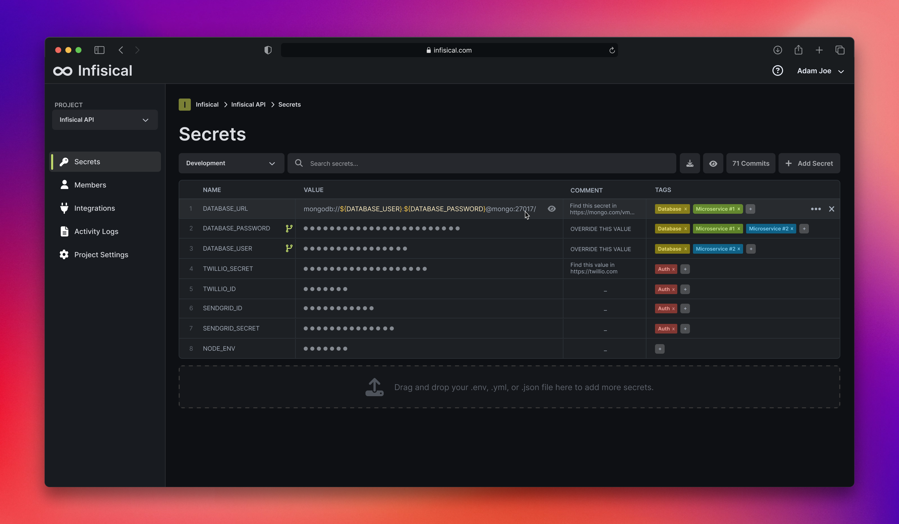

# Infisical CI/CD pipeline

Deploy Infisical server with CI/CD on Elestio

 
 

# Once deployed ...

You have to register with your email before the first use.

# CLI

To install the CLI : https://infisical.com/docs/cli/overview

To use the CLI : https://infisical.com/docs/cli/usage
